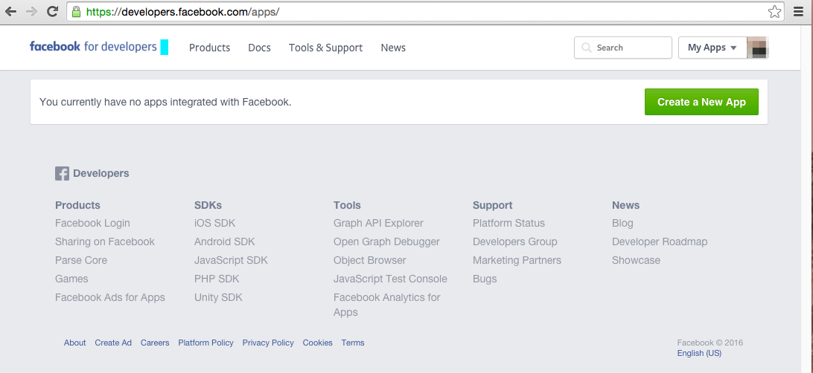
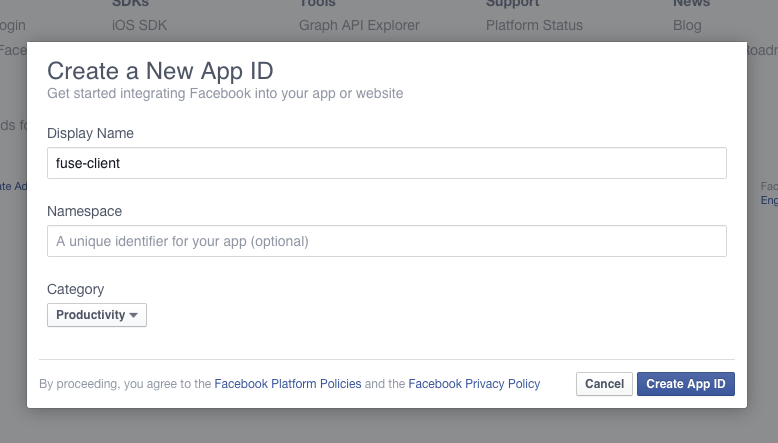
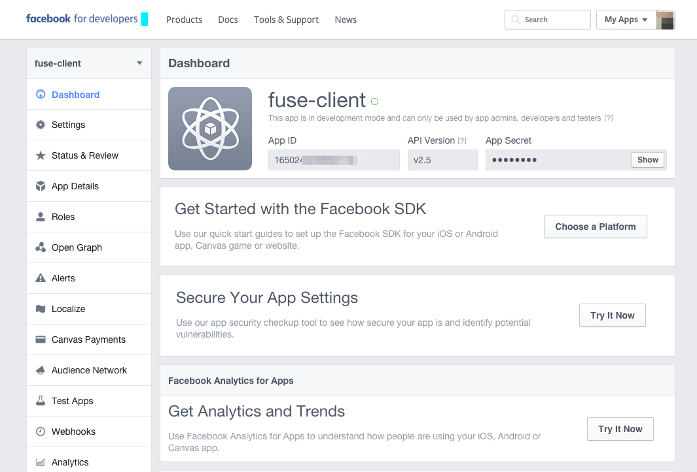
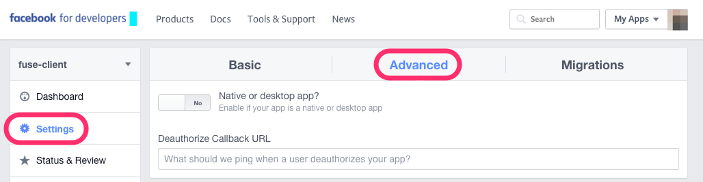
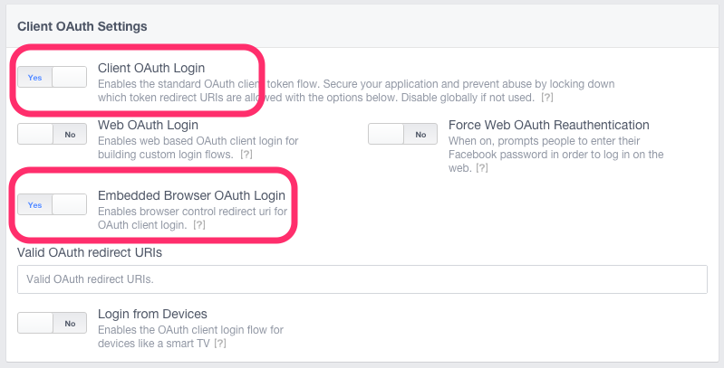

# Facebook login

This sample shows how one can login to Facebook using JavaScript and a `WebView`.

## Setup app

Before this sample will work, you need to setup an app in the Facebook Developer Portal. You can follow these instructions.

1. Go to [https://developers.facebook.com/apps/](https://developers.facebook.com/apps/) and click the "Create a New App" button.

2. Choose a display name and click "Create App ID"

3. Copy the App ID to the Auth.js file

4. Go to the "Add Product" screen. You should automatically be there if you just created your app. If not, you can find it in the left sidebar. From here, click the "Set up" button for the Facebook Login product.

5. Instead of following through the quickstart, go to settings from the side menu, and make sure "Client OAuth Login" and "Embedded Browser OAuth Login" is enabled.

