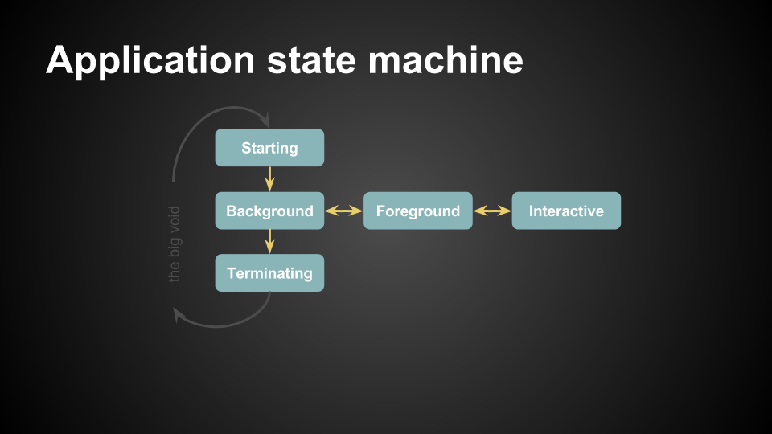

# Reacting to life-cycle events

Life-cycle events lets you respond to events such as the app being suspended, opened, closed and so on.

In this example, we will create an app that listens to life-cycle events, and reacts to them.

To listen to life-cycle events, import `FuseJS/Lifecycle` using `require`, and subscribe to events by setting your own functions as the event handlers.

## Losing and gaining control

`Lifecycle` module is an `EventEmitter`, so the methods from [EventEmitter](https://www.fusetools.com/docs/fusejs/eventemitter) can be used to listen to events.

The events `enteringInteractive` and `exitedInteractive` are used to handle loss and gain of control. These will fire when something else is overlaying the app on the screen (for example the notification bar on Android, or the overlaying chat window from Facebook Messenger. Note that the app is still running in the background in these two examples).

```
Lifecycle.on("enteringInteractive", function() {
    focused.value = true;
});

Lifecycle.on("exitedInteractive", function() {
    focused.value = false;
});
```

## App entrance and exit

The events `enteringForeground` and `enteringBackground` are called when the app starts/resumes, or is suspended.

```
Lifecycle.on("enteringForeground", function() {
    console.log("Hello!");
});

Lifecycle.on("enteringBackground", function() {
    console.log("See you later!");
});
```

## App termination

There is no `terminating` event and the reason for that is explained in [Lifecycle docs](https://www.fusetools.com/docs/fusejs/lifecycle#no-code-terminating-code-event)


Here is an illustration of how the different app-states relates to each other:



Take a look at the [JavaScript documentation](https://www.fusetools.com/docs/fusejs/lifecycle) for more details.

## The JavaScript

```
var Observable = require('FuseJS/Observable');
var Lifecycle = require('FuseJS/Lifecycle');

var focused = Observable(true);

Lifecycle.on("enteringInteractive", function() {
    focused.value = true;
});

Lifecycle.on("exitedInteractive", function() {
    focused.value = false;
});

Lifecycle.on("enteringForeground", function() {
    console.log("Hello!");
});

Lifecycle.on("enteringBackground", function() {
    console.log("See you later!");
});

module.exports = {
    focused: focused
};
```

## The UX

```
<App>
    <JavaScript File="MainView.js" />
    <Rectangle ux:Name="background" Color="#4CAF50" />
    <WhileFalse Value="{focused}">
        <Change background.Color="#FF9800" Duration=".5" />
    </WhileFalse>
</App>
```
